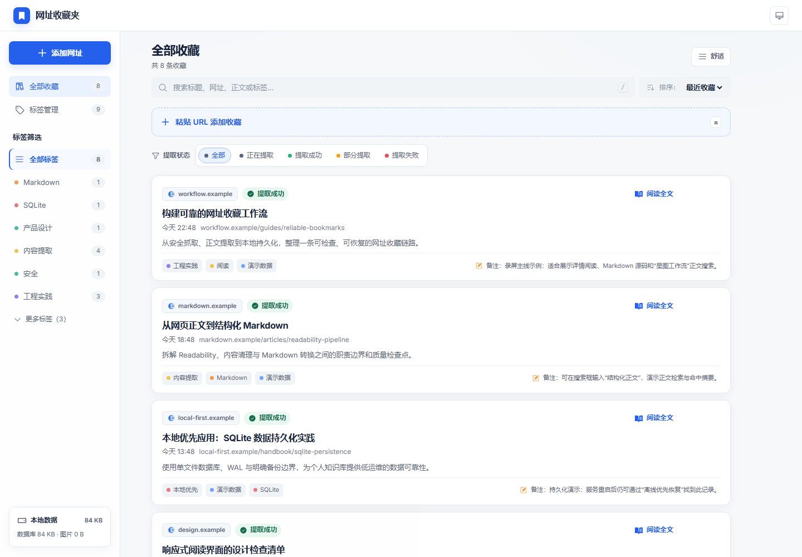
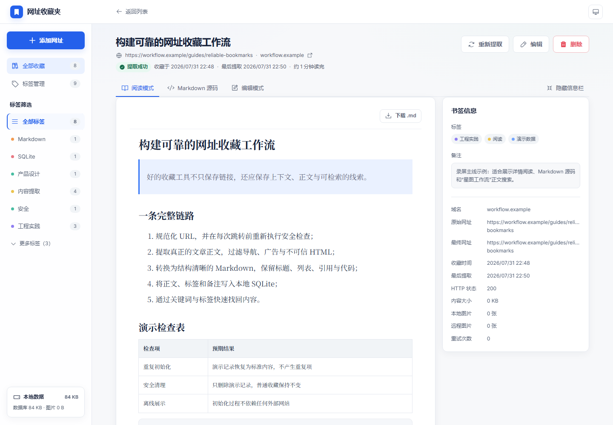

# 网址收藏夹

本地优先的网址收藏与正文阅读工具。粘贴 HTTP/HTTPS 网址后，应用在服务端完成
安全检查、网页抓取、正文提取、HTML 清理与 Markdown 转换，并写入本地 SQLite。
支持标签、搜索、编辑、重新提取、软删除恢复、图文导出与重启后持久化。





## 功能概览

- 粘贴网址 → 自动标题 → Readability 正文 → Markdown 持久化
- DNS/IP/重定向 SSRF 防护；失败书签仍保留并可手动编辑
- 多标签、关键词搜索、状态筛选、软删除约 10 分钟可撤销
- 正文图片与 Vega-Lite 动态图表安全归档；单篇 `.md` / ZIP 图文包导出
- 浅色/深色主题、键盘快捷键、桌面与 390px 移动布局
- Windows `setup.bat` / `start.bat`；可选自带 Node.js 的 x64 便携 ZIP

技术栈：Next.js 16、React 19、TypeScript、SQLite、Drizzle ORM、Undici、JSDOM、
Mozilla Readability、DOMPurify、Turndown、Vitest、Playwright。

## 快速开始

需要 Node.js 22+ 与 npm。无需数据库服务、付费 API 或第三方账号。

```bash
npm install
npm run db:migrate
npm run dev
```

打开 [http://localhost:3000](http://localhost:3000)。

Windows：

```text
setup.bat
start.bat
```

生产运行：

```bash
npm run db:migrate
npm run build
npm run start
```

便携包（维护者在 Windows x64 打包，终端用户无需安装 Node.js）：

```bash
npm run package:portable
```

产物：`release/url-bookmark-v1.0.0-win-x64.zip` 及 `.sha256`。解压后双击
`start.bat`；数据写在包内 `data/`，可用 `backup.bat` / `restore.bat` 备份恢复。
详情见 [docs/RUNNING.md](docs/RUNNING.md)。

## 数据与安全边界

- 数据：`data/bookmarks.db`、`data/assets/`（真实数据不进 Git）
- 只抓取 HTTP/HTTPS；不带 Cookie、不执行目标页 JavaScript
- 正文图片/SVG/Vega 图表有数量、大小与签名校验限制
- 不支持登录墙、验证码、强反爬与纯 JS 渲染站点的可靠提取

完整备份恢复、抓取边界与环境变量见 [docs/RUNNING.md](docs/RUNNING.md) 与
[SECURITY.md](SECURITY.md)。

## 测试

```bash
npx playwright install chromium   # 首次 E2E 需要
npm run typecheck
npm run lint
npm run test:unit                 # 62
npm run test:integration          # 39
npm run test:e2e                  # 7
npm run build
```

当前基线：**101** 项自动化测试 + **7** 项 Playwright E2E。常规 CI 见
`.github/workflows/ci.yml`，E2E 见 `.github/workflows/e2e.yml`。

稳定演示数据：`npm run db:seed:demo`（清除：`npm run db:clear:demo`）。
演示脚本见 [demo/demo-script.md](demo/demo-script.md)。

## 已知限制

- 不保证覆盖所有网站；失败时保留书签并显示错误码
- 自动分页最多合并同源同系列 10 页
- 超限、鉴权失败或不安全资源仍可能保留远程图片 URL
- 搜索为 SQLite LIKE，适合本地数千条；FTS5 / 全库批量 ZIP / 首页统计未做
- 单用户本地应用：无注册、权限、云同步、AI 摘要

## 文档

| 文档 | 说明 |
|------|------|
| [docs/DESIGN.md](docs/DESIGN.md) | 最终实现设计 |
| [docs/UI-SPEC.md](docs/UI-SPEC.md) | UI 规范 |
| [docs/RUNNING.md](docs/RUNNING.md) | 运行、备份与便携包 |
| [FINAL-ACCEPTANCE-REPORT.md](FINAL-ACCEPTANCE-REPORT.md) | 验收报告 |
| [AI-USAGE.md](AI-USAGE.md) | AI 协作说明 |
| [CHANGELOG.md](CHANGELOG.md) | 版本变更 |
| [LICENSE](LICENSE) | MIT |
